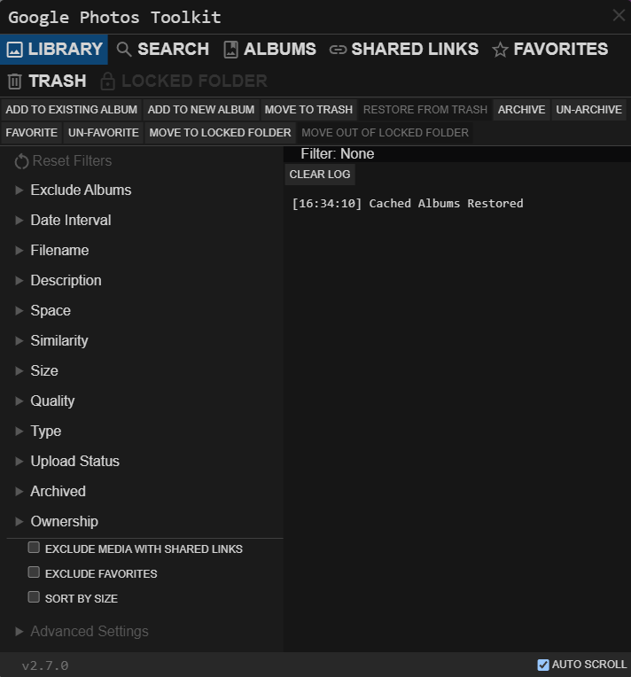
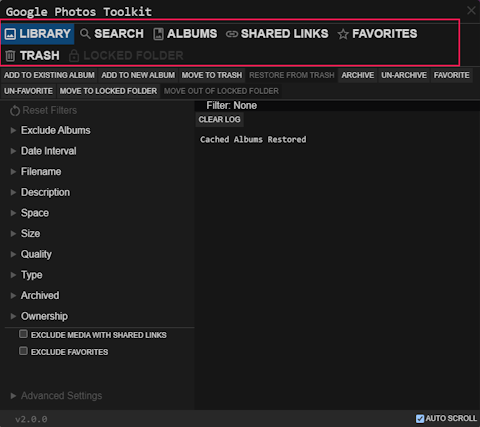
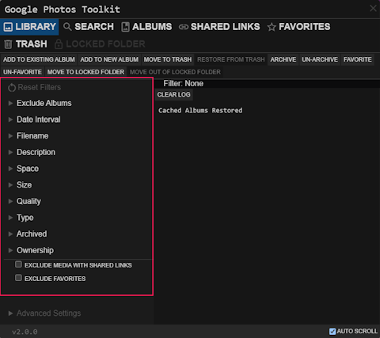
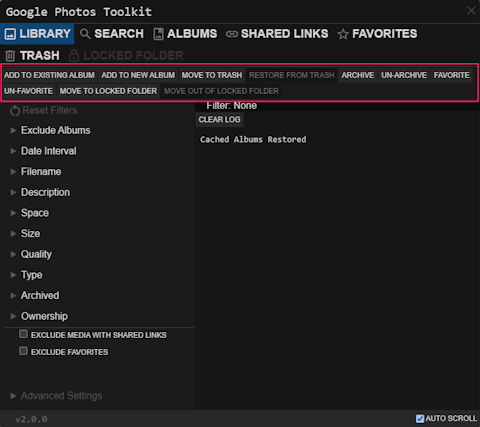

# Google Photos Toolkit
Bulk organize your media



## How It Works
In your browser, utilizing GP's undocumented web api

## How To Install
1. Install any recommended userscript manager for your browser
    * [Violentmonkey](https://violentmonkey.github.io/)
    * [Tampermonkey](https://www.tampermonkey.net/)
    * If you're on Android, try [Firefox](https://www.mozilla.org/firefox/browsers/mobile/android/) browser, it supports Tampermonkey

2. Click [Install](https://github.com/xob0t/Google-Photos-Toolkit/releases/latest/download/google_photos_toolkit.user.js)
3. Accept installation

## How to use
<details>
  <summary>Tutorial</summary>

1. Go to [photos.google.com](https://photos.google.com/) and click the GPTK icon in the top bar to open it

    
2. Select a source from which to read from:

    
3. Use Filters to filter found items with:

    
4. Select an action to apply to found items:

    
  
</details>

  ### Finding space-consuming media
  This example groups all space-consuming media in one album.

  1. Make sure "Library" is the selected source
  2. Select `SPACE-CONSUMING` in the `Space` filter
  3. Select action `Add to new album`

  ### Deleting all media in the library
  As simple as selecting "Library" source, clicking `Move to trash`, then clearing it.

  ### Use GPTK's api
  GPTK exports it's api class globally so you can use it in your browser's console.

  Example usage.
  ```
  // getting the fist page of the library by taken date
  const libraryPage = await gptkApi.listItemsByTakenDate()
  // getting the info of the first item on the page
  const itemInfo = await gptkApi.getItemInfo(libraryPage.items[0].productId)
  console.log(itemInfo)
  ```


## BUGS
If something does not work, open an [issue](https://github.com/xob0t/Google-Photos-Toolkit/issues) and describe it in detail

If you have a question, open a [discussion](https://github.com/xob0t/Google-Photos-Toolkit/discussions)

## Credits
Borrowed some code and UI inspiration from [undiscord](https://github.com/victornpb/undiscord)

## ♥
If GPTK is useful to you, please consider supporting the project:

[Steam](https://steamcommunity.com/tradeoffer/new/?partner=108584965&token=BXrJr_O7)

BTC `12znTocLytrrYhQT4AJVeJdR8KTULWbKb7`
